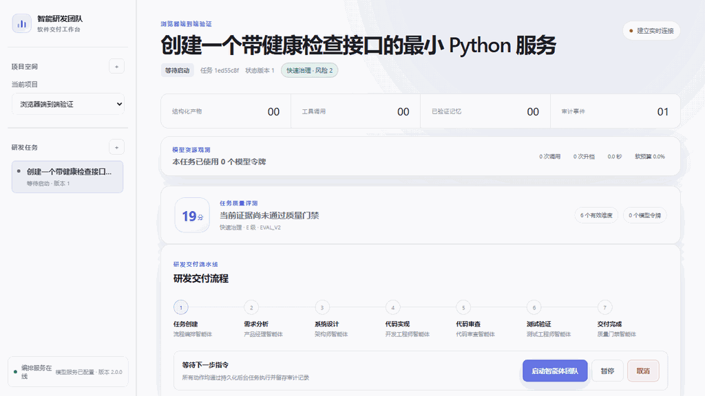

# DevTeam Agent V2

[](https://github.com/Sahotin/devteam-agent/actions/workflows/quality.yml)


DevTeam Agent 是一个面向工程交付的、由结构化产物驱动的 Multi-Agent 软件研发系统。它把确定性 Workflow 与受控 Agent Harness 结合，并提供 Skill、只读 MCP Context、路径与测试沙箱、Checkpoint 恢复、Trace 和确定性 Agent Evaluation。系统强调 controlled、recoverable、observable、evaluatable，不以“完全自主软件工程师”为目标。

## 运行效果

<p align="center">
  
</p>

<p align="center"><sub>使用内置 Demo Provider 运行的真实浏览器端到端流程：任务创建 → PRD 审批 → 架构选择 → 代码实现 → Review → Test → Delivery。</sub></p>

### 核心工程问题与实现

| 工程问题 | 实现机制 | 可验证证据 |
| --- | --- | --- |
| 多 Agent 容易失控、上下文漂移 | 确定性状态机编排 7 个 LLM 角色，以 Pydantic Artifact 传递结构化信息 | Workflow 状态、Artifact、ToolCall 与事件均持久化 |
| 长任务中断后难以继续 | 持久化 Execution Job、阶段 Checkpoint、幂等恢复与有限返工 | 服务重启恢复测试、失败上限和恢复事件 |
| Coding Agent 可能越权修改 | ToolRegistry 权限交集、Workspace 路径约束、文件哈希、原子写入和 Git 质量门禁 | 工具审计、安全负例及受控提交链路 |
| 大仓库 Context 过长 | 增量代码索引、BM25 + 可插拔 Dense Embedding + RRF、相邻 Chunk 合并与 Token Budget | 独立 Retrieval Eval 与检索 Trace |
| 测试结果只有原始日志 | 九种白名单 Runner；Robot Framework `output.xml` 解析为用例级结构化结果 | 205 项后端测试、82.17% 分支覆盖率门禁 |
| 外部 Agent 接入边界不统一 | `safe-code-change` Skill + 只读 stdio MCP，经 ToolRegistry 暴露项目 Context、代码检索和 Memory | 真实 MCP Client 测试与端到端使用验证 |

[快速开始](#本地启动) · [工作流](#工作流) · [Hybrid Retrieval](#hybrid-code-retrieval) · [测试与质量门禁](#验证) · [真实实现边界](docs/devteamagent_v2/resume_facts.md)

```text
User → Workflow State Machine → Agent Harness
                               ├─ Context / Budget / Stop / Skill
                               ├─ Model Router
                               └─ MCP Context + ToolRegistry Actions
                                            ↓
                                  Workspace / Repository

Trace ← Event / ToolCall          Checkpoint ← Workflow Gate
Eval  ← Artifact / Trace / Usage
```

## 已实现能力

- 统一 Agent Harness：7 个 LLM 研发角色与确定性 Visual Reviewer 均通过统一 Run Scope 执行，记录 run_id、状态、Context、模型、工具、预算、验证和失败事件
- 硬预算与停止策略：限制 Step、LLM/Tool 调用、Token、修复轮次、修改文件和超时，并检测重复工具参数、重复错误和无新增 Context
- `safe-code-change` Skill：同时提供 Codex Host 指令和机器可校验配置，服务端强制工具白名单交集及写前检索/目标读取
- 真实 stdio MCP Server：仅提供 `get_project_context`、`search_code`、`query_memory`，固定权限并全部经过 ToolRegistry
- 统一 ContextBuilder：核心任务/失败证据优先，RAG、Memory 与历史 Context 在 Token 预算内确定性裁剪，并仅记录来源引用
- 确定性 Tool Calling 轨迹评测：检查写前检索、写后测试、非法调用、重复调用、Skill、Budget 与 Loop 违反

- Product、Designer、Architect、Developer、Reviewer、Tester 六个核心 Agent 协作，并由 Diagnostic 与 Visual Reviewer 承担专项诊断和确定性质量检查
- PRD 与架构人工审批、审查与测试失败自动返工
- 需求文档结构化编辑、版本留痕，并由下游 Agent 自动读取最新修订
- 交付项目启动方式识别、一键启动/停止、外部浏览器访问、健康检查与实时日志
- 简短需求智能补全：自动推导目标用户、用户旅程、页面清单、内容策略与合理默认决策
- 独立 UI/UX Designer Agent：生成多套视觉方向、页面体验规范、Design Token 与质量标准
- 内置产品模板目录：学习产品、SaaS 工作台、内容展示和数据决策中心
- 系统设计阶段可同时选择视觉方案与技术架构，也可全部交给智能体自主决策
- Visual Reviewer：执行响应式、交互反馈、内容、无障碍和设计一致性量化门禁
- 可运行静态页面自动生成桌面/手机真实浏览器截图，低于质量门槛时自动返回开发阶段修订
- 面向开发初学者的可解释产物：需求编号支持悬浮预览与点击查看；接口、技术术语、文件路径和代码标识符支持按需讲解；新架构文档还会生成接口输入输出、使用示例、核心原理与学习建议
- 质量门禁按代码审查、测试和视觉检查分别计算返工额度；自动返工达到上限后，用户可确认追加最多两轮受控智能修复，系统会汇总历次反馈并展示仍未解决的问题
- 故障修复任务优先复现来源项目，并把真实运行状态作为诊断证据
- 失败任务提供中文原因解释、一键恢复重执行和独立故障修复任务三层恢复路径
- Reviewer 自动校正验收标准与需求编号，避免结构化产物错误造成重复失败
- Developer 在写入前重新读取文件，支持幂等修改、哈希刷新和内容失配自动重新规划
- 静态网页通过本地 HTTP 可访问性与资源完整性检查后才能完成交付
- 自动发现仓库中的 Robot Framework 套件，通过白名单 Runner 执行关键字驱动验收测试，并把 `output.xml` 解析为用例级通过、失败、跳过与失败定位信息
- 任务状态机、Checkpoint、暂停、恢复、取消和失败限制
- File、Code Search、Terminal、Git、RAG、Memory 工具及权限审计
- 安全路径校验、文件哈希并发保护、测试命令白名单和输出脱敏
- Git 提交前质量门禁和文件哈希一致性校验
- 仓库增量索引、语言感知切片、可插拔 Embedding、BM25 与 RRF 混合检索；默认 Hash Embedding 仅作为离线确定性基线
- Short-term、Project、Long-term 三层 Memory
- Memory 脱敏、去重、冲突候选、人工验证、版本失效和任务完成后沉淀
- Agent 产物记录实际引用的代码上下文及记忆 ID，支持全链路审计
- 持久化 Execution Job、后台 Worker 和服务重启恢复
- 单任务活动作业互斥、失败审计、排队取消和可配置 Worker 并发度
- SSE 实时事件流、事件 ID 断点续传、心跳及任务可观测聚合接口
- React、TypeScript、Vite 构建的响应式研发工作台
- 面向用户界面的默认极简高级设计规范与跨 Agent 视觉质量审查
- 项目与任务管理、PRD/架构审批、Review/Test 操作面板
- Agent 实时时间线、Artifact、ToolCall、Memory 引用审计视图
- Demo/OpenAI 双模型 Provider，基于 Responses API Structured Outputs
- API Key、数据库凭证和配置项的显式安全边界
- Alembic 数据库迁移及 SQLite/PostgreSQL 双环境
- JSON 结构化日志、Request ID、Readiness 和 Prometheus 指标
- 非 root 多阶段 Docker 镜像与 PostgreSQL Compose 一键启动
- 可重复执行的完整工作流冒烟验证脚本
- Playwright 浏览器端到端测试：从需求页面依次完成需求审批、AI 架构选择、代码实现、审查、测试与交付说明验证
- SQLite 持久化与 FastAPI 接口
- 确定性任务复杂度评分：结合需求语义、仓库规模、执行范围和质量偏好选择 FAST、STANDARD 或 STRICT，并持久化可解释的评分依据
- 基于真实产物、审查、测试、失败恢复和模型用量的确定性任务质量评测；严格按照实际执行终点判断，方案类任务不会因没有代码被误扣分
- 任务完成后支持保存用户满意度与成果验收反馈，主观反馈和客观工程质量分开记录
- 项目级聚合 FAST、STANDARD、STRICT 的质量、成本和满意度，并在样本充足后给出可解释的校准建议；不会自动修改治理阈值
- 内置 21 个版本化策略基准场景，覆盖局部修改、多页面功能、审查、支付、权限、数据迁移和核心重构，可重复验证路由决策

V2 的真实边界与后续项见 [Resume Facts](docs/devteamagent_v2/resume_facts.md)。当前尚未实现每任务自动 Git Worktree、通用动态 DAG 和并行 Sub-Agent，不应把这些规划项描述成已完成。

## 工作流

```text
CREATED
  -> REQUIREMENT_ANALYZING
  -> PRD_APPROVAL
  -> ARCHITECTING
  -> ARCH_APPROVAL
  -> CODING
  -> REVIEWING
  -> TESTING
  -> FINAL_VALIDATION
  -> COMPLETED
```

Reviewer 返回 `CHANGES_REQUESTED` 或测试失败时，工作流会携带结构化反馈返回 Developer。系统限制最大返工次数，避免 Agent 无限循环。只有最新 Review 为 `APPROVED`、测试为 `PASSED` 且文件哈希与 CodeChange Artifact 一致时，编排器才会授予一次 Git Commit 权限。

### 任务治理决策

创建任务时可以选择执行终点（自动完整交付、方案完成后停止、代码实现后停止、代码审查后停止或完整流程）以及经济、均衡、质量三种偏好。被省略的是终点之后的阶段，前置需求与架构上下文仍会生成，避免无依据地直接修改代码。系统通过确定性规则计算风险分数：普通修改按需求范围和现有仓库规模加权；支付、认证权限、数据库迁移、不可逆数据操作和敏感数据属于硬风险，始终强制进入 `STRICT`，不能被经济模式降级。决策结果、评分原因和硬风险标识保存在任务策略记录中，工作台顶部可点击治理标签查看完整说明。

### 动态模型路由

任务治理等级会在运行期决定每个 Agent 的模型档位。`FAST` 让产品、体验与测试优先使用轻量档，架构、开发与审查使用标准档；`STANDARD` 按角色基线分配；`STRICT` 强制所有 Agent 使用强档。轻量、标准和强档默认输出上限分别不超过 4096、8192 和全局 Token 上限，也可以通过环境变量单独覆盖。

模型输出格式不合规或结论置信度不足时，路由器会按 `LIGHT -> STANDARD -> STRONG` 自动升级；从检查点恢复时初始档位会提升一级。连接中断、超时、鉴权失败和限流不会进行无意义的外层重复调用。每次选择、升级、完成和失败都会写入任务事件，记录 Agent、模型、档位、Token 上限、思考模式、尝试次数和决策原因，但不会保存 Prompt、API Key 或业务载荷。

### 模型用量与性能观测

DeepSeek 与 OpenAI Provider 会从官方响应的 `usage` 字段采集输入、输出、缓存输入、推理和总 Token，用量通过 `ContextVar` 绑定到当前并发任务，不会串入其他任务。动态路由层同时记录每次尝试的耗时、模型档位、升档次数和失败次数；内部结构化纠错产生的多次 Provider 调用会合并到对应路由尝试中。

工作台的“模型资源观测”面板按 Agent 展示调用次数、升档次数、总 Token 和耗时。`FAST`、`STANDARD`、`STRICT` 的默认软预算分别为 6 万、15 万和 30 万 Token；达到 80% 时仅生成中文提醒，不会中断研发工作流。审计事件只保存数字指标和模型元数据，不保存 Prompt、API Key 或业务请求载荷。

### 质量评测与策略校准

`GET /api/v1/tasks/{task_id}/evaluation` 会根据最新结构化产物和审计事件计算需求完整性、架构与体验设计、代码实现、审查测试、工作流稳定性和模型资源效率。评分器不调用大模型，因此同一份证据会得到相同结果；历史产物结构不完整时会降级为“证据不足”，不会影响原工作流。

完成任务后可以通过 `POST /api/v1/tasks/{task_id}/evaluation-feedback` 保存 1–5 分满意度、成果是否符合预期和文字反馈。`GET /api/v1/projects/{project_id}/evaluation-summary` 按治理等级聚合客观质量、Token、耗时和主观评分。每个治理等级至少积累三个任务后才会产生针对性校准建议，系统不会未经用户确认自动改写策略。`GET /api/v1/evaluation/benchmark` 可运行内置的确定性策略回归集。

标准评测集现包含 21 个版本化场景。`scripts/run_agent_evaluation.py` 可以真实执行选定场景，记录完成率、质量门禁、任务评分、Token、模型与墙钟耗时、升档、恢复和失败次数，并生成 JSON/Markdown 报告。通过 `DEVTEAM_MODEL_ROUTING_STRATEGY` 可在 `DYNAMIC`、`FIXED_LIGHT`、`FIXED_STANDARD` 和 `FIXED_STRONG` 之间切换，使用同一场景集合进行对照。完整说明见 [Agent Evaluation 使用说明](docs/evaluation/agent-evaluation.md)。

## Memory 工作方式

- Short-term Memory 保存当前任务每一阶段的结构化产物，任务完成后自动标记为 `STALE`。
- Project Memory 保存已验证的架构决策和项目约定。
- Long-term Memory 保存已在完成任务中得到验证的审查修复和测试失败经验。
- 所有写入先进行敏感信息脱敏，并使用规范化内容指纹去重。
- 带相同 `conflict_key` 的矛盾事实不会直接覆盖旧事实，而是降级为 `CANDIDATE`，等待人工验证。
- 记忆检索使用 BM25、Hash Embedding 与 Reciprocal Rank Fusion，并结合可信度和状态加权。

## Hybrid Code Retrieval

代码中的文件名、类名、函数名和异常字符串需要精确词法匹配，因此 BM25 仍然保留；自然语言问题与源码命名不一致时，则可以由语义 Embedding 补充召回。代码检索链路为：

```text
Query
 ├─ BM25 sparse candidates
 └─ Embedding dense candidates
             ↓
      Reciprocal Rank Fusion
             ↓
   Metadata Filter / Dedup / Merge
             ↓
     Agent source_context
             ↓
   ContextBuilder / Token Budget
             ↓
            LLM
```

融合使用 `RRF(d) = Σ 1 / (k + rank_i(d))`，默认 `k=60`。RRF 只依赖每一路的排名，不直接相加量纲不同的 BM25 分数和余弦相似度。搜索支持 `bm25`、`vector`、`hybrid` 三种模式，并返回 `bm25_rank`、`dense_rank`、`matched_by`、索引版本、耗时和降级原因。基础过滤支持文件路径、路径前缀、语言和符号类型；重叠或相邻 Chunk 会在最大字符限制内合并，最终仍由 ContextBuilder 执行全局 Token 预算。

索引 Manifest 由文件 SHA-256、Embedding Provider 标识和 Chunker 版本共同决定。未变化文件不会重新切片或 Embedding；新增和修改文件批量生成向量，删除文件清理对应 Chunk。一次扫描中的删除、稀疏检索元数据和向量记录在同一数据库事务提交，失败时保留上一代索引。向量随 `code_chunks` 持久化到 `DEVTEAM_DATABASE_URL` 指向的 SQLite/PostgreSQL，不依赖外部向量数据库；文件重命名按删除加新增处理。

默认配置使用 `hash` Provider，以保证离线测试和 Demo 可重复。它是词法哈希基线，不应描述成语义 Embedding。接入兼容 OpenAI `/embeddings` 的真实语义模型时配置：

```env
DEVTEAM_EMBEDDING_PROVIDER=openai
DEVTEAM_EMBEDDING_MODEL=text-embedding-3-small
DEVTEAM_EMBEDDING_DIMENSION=256
DEVTEAM_EMBEDDING_BATCH_SIZE=32
DEVTEAM_EMBEDDING_API_KEY=your-embedding-api-key
DEVTEAM_EMBEDDING_BASE_URL=
```

检索参数统一使用 `DEVTEAM_RETRIEVAL_MODE`、`DEVTEAM_RETRIEVAL_BM25_TOP_K`、`DEVTEAM_RETRIEVAL_DENSE_TOP_K`、`DEVTEAM_RETRIEVAL_FINAL_TOP_K`、`DEVTEAM_RETRIEVAL_RRF_K`、`DEVTEAM_RETRIEVAL_MAX_MERGED_CHARS` 和 `DEVTEAM_RETRIEVAL_TIMEOUT_SECONDS`。修改 Provider、模型维度或 Chunker 版本后，下次调用项目索引接口会根据 Manifest 自动重建受影响的向量；若要强制全量重建，调用 `POST /api/v1/projects/{project_id}/index?force=true`。

Dense 建索引失败时，本轮写入零向量并明确记录 `dense_index:*` 降级原因，BM25 仍可搜索；该 Manifest 不会被视为最新，下一次索引会重试 Embedding。Hybrid 查询阶段某一路失败时降级到另一路并保留 `fallback` 与 `RETRIEVAL_COMPLETED` Trace；显式 `vector` 模式失败则返回错误，不会伪装成成功。

独立检索评测使用人工核验的 JSON 用例，并真实比较 Recall@K、MRR 和 Precision@K：

```text
python scripts/run_retrieval_evaluation.py . --k 5
```

用例位于 `docs/rag/retrieval_eval_cases.json`。默认 Hash Provider 的结果只是回归基线；只有在同一人工标注集合上配置并运行真实语义 Provider 后，才能比较 Hybrid 是否优于 BM25，不能从自动生成样本推导性能结论。

## 后台执行与事件流

客户端可以通过 `POST /api/v1/tasks/{task_id}/executions` 提交 `START`、`DECIDE_PRD`、`DECIDE_ARCHITECTURE`、`RUN_REVIEW` 或 `RUN_TESTS` 动作，并立即获得持久化 Execution ID。Worker 在后台执行工作流，客户端通过 Execution 查询接口或 SSE 事件流跟踪进度。

每个任务最多存在一个 `QUEUED` 或 `RUNNING` 作业。服务重启时，未完成的 `RUNNING` 作业会恢复为 `QUEUED` 并重新进入队列。`DEVTEAM_WORKER_CONCURRENCY` 可以配置单进程 Worker 数量，默认值为 1。

## 本地启动

1. 准备 Python 3.11+ 环境。
2. 安装开发依赖：开发时可执行 `pip install -e ".[dev]"`；复现当前验证环境时先执行 `pip install -r requirements-dev.lock`，再执行 `pip install --no-deps -e .`。
3. 启动服务：`uvicorn backend.app.main:app --reload`。
4. 打开 `http://127.0.0.1:8000/docs`。

前端开发模式：

1. 进入 `frontend`。
2. 执行 `pnpm install`。
3. 执行 `pnpm dev`。
4. 打开 `http://127.0.0.1:5173`。

前端开发服务器会将 `/api` 代理到 `http://127.0.0.1:8000`。执行 `pnpm build` 后，FastAPI 会自动托管 `frontend/dist`，此时可以直接打开 `http://127.0.0.1:8000` 使用完整工作台。

### 浏览器级核心流程回归

进入 frontend 目录后执行：

    pnpm exec playwright install chromium
    pnpm test:e2e

测试脚本会使用 Demo Provider 和独立 SQLite 数据库，在随机空闲端口启动 FastAPI 与 Vite，完成后回收测试进程，不会读写正式任务数据库。

## 使用真实模型

默认使用确定性的 Demo Provider，适合测试和项目演示。切换 OpenAI Provider：

```text
DEVTEAM_LLM_PROVIDER=openai
DEVTEAM_LLM_MODEL=gpt-5.6-sol
OPENAI_API_KEY=your-api-key
```

系统使用 OpenAI Responses API Structured Outputs 将 Pydantic Artifact Schema 直接作为输出约束，并设置 `store=false`。API Key 只从环境变量读取，不会出现在 Capability API、Artifact、Memory、ToolCall 或日志中。模型可用性取决于 API 账户权限，也可通过 `DEVTEAM_LLM_MODEL` 显式覆盖。

## Docker Compose

```text
docker compose up --build
```

Compose 会启动 PostgreSQL，等待数据库健康后执行 `alembic upgrade head`，再启动 API、Worker 和前端工作台。默认地址为 `http://127.0.0.1:8000`。

最终应用镜像同时包含 Python 3.12 与 Node.js 24/npm，使受限终端执行器能够在容器中验证 Agent 生成的 Python 和 Node.js 项目。Maven 项目仍建议使用独立的预构建沙箱镜像。

若使用真实模型，请在未提交到版本库的 `.env` 中设置 `OPENAI_API_KEY`；生产或共享环境必须同时修改默认 PostgreSQL 密码。

默认使用 SQLite，数据库位于 `data/devteam_agent.db`。当前 Demo Model 用于稳定演示结构化工作流；它只会在目标项目的 `.devteam/tasks/` 下生成可追踪的实现计划，不会虚构业务代码或测试已经完成。

Terminal Tool 默认使用本地受限执行器，仅接受 `NODE_CHECK`、`STATIC_PAGE_CHECK`、`PYTHON_COMPILE`、`PYTEST`、`ROBOT`、`UNITTEST`、`NPM_TEST`、`NPM_BUILD` 和 `MAVEN_TEST` 九种预定义 Runner。也可以通过 `DEVTEAM_TERMINAL_EXECUTOR=docker` 启用关闭网络、限制资源和移除 Linux capabilities 的 Docker 执行器。

当目标仓库的 `tests/`、`robot/` 或根目录存在 `.robot` 文件时，Tester Agent 会确定性地把 `ROBOT` 加入测试计划，而不是仅依赖模型选择。执行产物保存在目标仓库的 `.devteam/test-results/robot/`，系统对 `output.xml` 做大小限制、危险声明拒绝和结构化解析；测试失败详情进入 Test Artifact 前会再次脱敏，ToolCall 审计只保存统计和产物路径。Docker 模式使用固定的 Python Runner：

```text
docker build -t devteam-agent/python-runner:0.6.0 sandbox/python
```

## 验证

```text
python -m ruff check backend scripts
python -m pytest --cov=backend.app --cov-report=term-missing:skip-covered --cov-report=xml --cov-fail-under=80
python -m compileall -q backend scripts
python -m pip check
cd frontend && pnpm typecheck
cd frontend && pnpm test:coverage
cd frontend && pnpm build
python scripts/smoke_test.py
```

后端覆盖率门禁当前为 80%；启用分支覆盖后的本次核验基线为 82.17%（205 项测试通过）。前端覆盖率目前仅建立防回退基线，组件与浏览器交互测试仍是后续重点，不能把工具函数测试等同于完整 UI 验证。GitHub Actions 会在 Python 3.11/3.12 上运行后端检查，并执行前端类型检查、测试、生产构建、离线 Demo 工作流冒烟和 Docker 镜像构建。

真实模型阶段可能受到网络和模型响应时间影响。冒烟脚本默认允许每个动作执行 180 秒，可通过 `DEVTEAM_SMOKE_EXECUTION_TIMEOUT` 调整；CI 始终使用不联网的 Demo Provider，将模型服务波动与代码回归分开。

详细中文实现说明见 [docs/architecture/implementation-v1.0.md](docs/architecture/implementation-v1.0.md)，最终验收结论见 [docs/milestones/v1.0验收报告.md](docs/milestones/v1.0验收报告.md)。

## DeepSeek 配置

系统支持通过独立适配器接入 DeepSeek Chat Completions API。适配器会请求 JSON Output，并在本地执行 JSON 解析、Pydantic Schema 校验和有限重试。

```env
DEVTEAM_LLM_PROVIDER=deepseek
DEVTEAM_LLM_MODEL=deepseek-v4-flash
# 可选：留空时继承 DEVTEAM_LLM_MODEL
DEVTEAM_LLM_LIGHT_MODEL=
DEVTEAM_LLM_STANDARD_MODEL=
DEVTEAM_LLM_STRONG_MODEL=
DEEPSEEK_API_KEY=your-new-api-key
DEEPSEEK_BASE_URL=https://api.deepseek.com
DEVTEAM_DEEPSEEK_LIGHT_THINKING_ENABLED=false
DEVTEAM_DEEPSEEK_STANDARD_THINKING_ENABLED=false
DEVTEAM_DEEPSEEK_STRONG_THINKING_ENABLED=true
DEVTEAM_DEEPSEEK_LIGHT_MAX_OUTPUT_TOKENS=4096
DEVTEAM_DEEPSEEK_STANDARD_MAX_OUTPUT_TOKENS=8192
DEVTEAM_DEEPSEEK_STRONG_MAX_OUTPUT_TOKENS=16384
DEVTEAM_DEEPSEEK_TIMEOUT_SECONDS=120
DEVTEAM_DEEPSEEK_MAX_RETRIES=1
```

模型路由默认将 Product、Designer、Tester 分配到 `STANDARD`，将 Architect、Developer、Reviewer、Diagnostic 分配到 `STRONG`。当前阶段按角色使用固定基础档位；未配置分档变量时，三档会完整继承原有全局模型、Thinking 和输出上限，因此旧 `.env` 无需迁移。`GET /api/v1/capabilities` 可查看当前三档配置与 Agent 分配结果，但不会返回 API Key。
只有目标 DeepSeek 模型明确支持 Thinking 参数时，才应为对应档位启用该选项。

真实密钥只能保存在已被 Git 忽略的 `.env` 或部署平台的 Secret 中，禁止写入源码、文档、Artifact、Memory 或日志。
本地服务启动时会自动读取项目根目录的 `.env`，但不会覆盖操作系统中已经设置的环境变量。
默认使用低延迟的 `deepseek-v4-flash`；需要更强的复杂推理质量时，可改回 `deepseek-v4-pro`。

## Windows 一键启动

在项目根目录双击 `启动 DevTeam Agent.bat`。启动器会检查虚拟环境与 `.env` 配置，在服务健康检查通过后自动打开浏览器。运行窗口会持续显示后端日志；需要停止服务时，在该窗口按 `Ctrl+C`。

## macOS Apple Silicon 一键部署

适用于 M1/M2/M3/M4 Mac。首次解压后执行 `bash scripts/install_macos.sh`，安装完成后双击 `启动 DevTeam Agent.command`，或执行 `bash scripts/start_macos.sh`。详细步骤见 [macOS部署说明.md](macOS部署说明.md)。部署包不得包含 `.env`、历史数据库、Windows `.venv` 或 `node_modules`。
